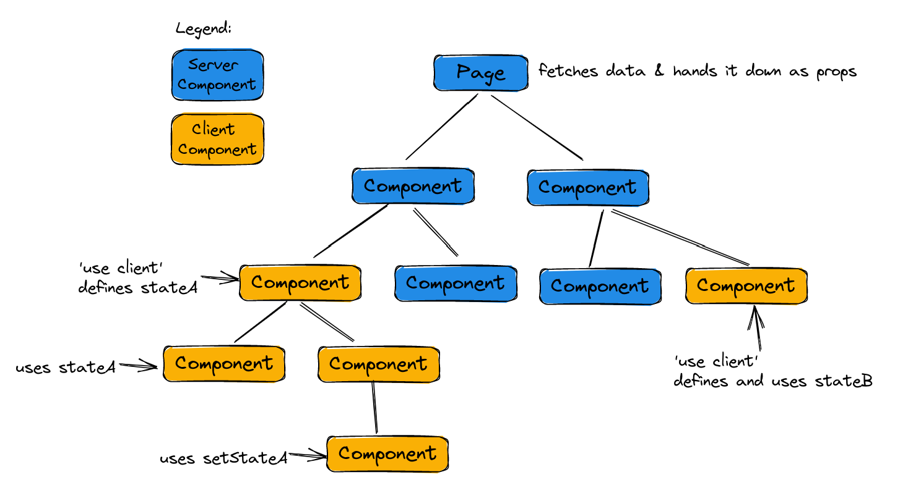
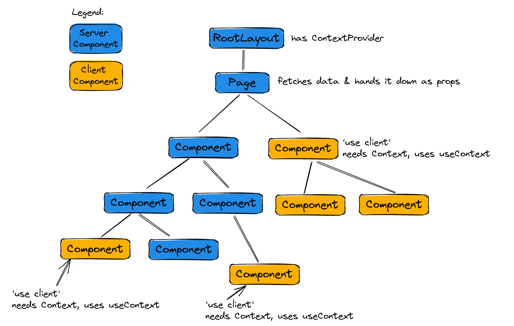
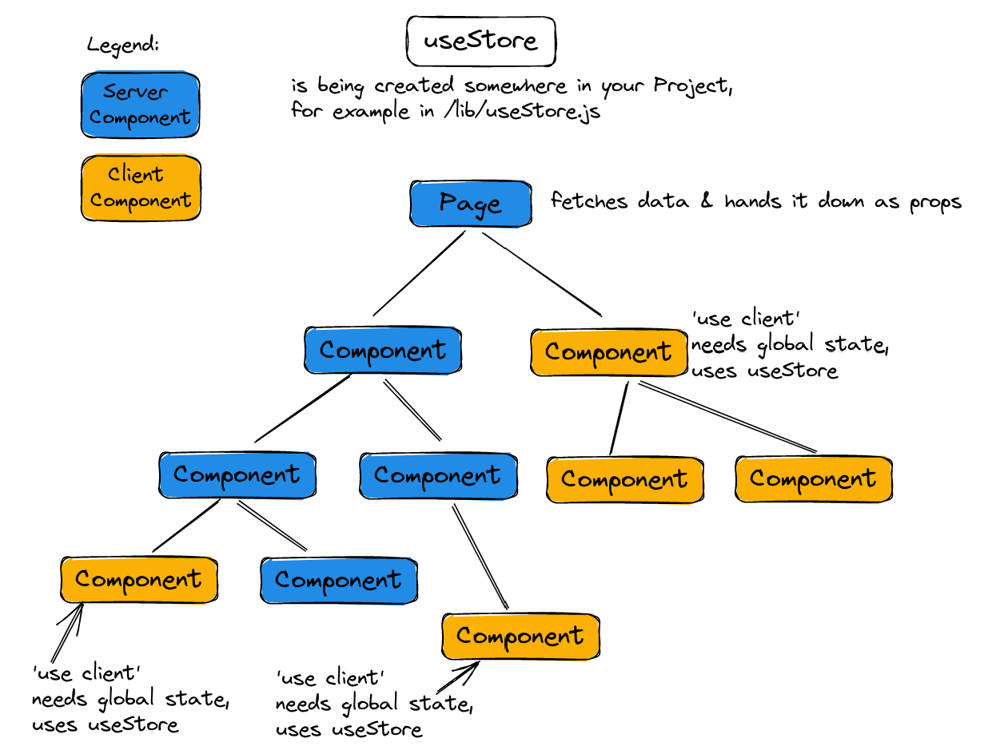

# Art Gallery Next.js 13 Challenge

Here you find an Art Gallery App without interactivity. Fix the App and implement the following functionality:

- Fetch real data from the API instead of using the hard coded data. You can use the function provided in [/lib/fetchArtPieces.js](./lib/fetchArtPieces.js)
- Make sure the statically generated pages using the fetched data will be revalidated after 5 minutes
- Make the favorite buttons work, so that users can mark / unmark art pieces as favorites. Use localStorage to persist which pieces are favorites.
- Make the favorite page only show the favorite pieces.
- Make the details page show the details of the correct art piece.
- Make the comment form work and persist comments in localStorage.
- Make sure the details page gets statically generated at build time for all art pieces.
- Make the spotlight page show a random art pieces every time the user visits the website or reloads the browser.
  - Implement choosing a random piece on the server (make sure it works in production builds)

## Recipe: local state

- Make your Server Components fetch data and pass it down as props the whole tree through prop drilling
- Use local state only where you need it
- Place local state as far down in the component tree as possible



=> Hint: With this model, as soon as the user navigates to another page, the state is lost (as it normally is with React once the state holding component unmounts). You can use localStorage (or any other kind of storage) to have persisted state between page changes and browser reloads.

## Recipe: Context API

- Make your Server Components fetch data and pass it down as props the whole tree through prop drilling
- If you want to share client state over multiple pages you can place a provider component in the RootLayout component. Even though the provider component is a Client Component you can hand it Server Components through the children prop:

```js
export const CountContext = useContext();

export const CountContextProvider = ({ children }) => {
  const [count, setCount] = useState(0);

  return (
    <CountContext.Provider value={{ count, setCount }}>
      {children}
    </CountContext.Provider>
  );
};
```

```js
export default function RootLayout({ children }) {
  return (
    <html lang="en">
      <body>
        <main>
          <CountContextProvider>{children}</CountContextProvider>
        </main>
      </body>
    </html>
  );
}
```

- Make use of `useContext` in Client Components where needed. Try to push these uses of the context down the component tree.



## Recipe: Zustand

- Make your Server Components fetch data and pass it down as props the whole tree through prop drilling
- create your Zustand store with the client only state.
- Access the store from any Client Component that needs it through the `useStore` hook. Try to push these uses of the store down the component tree.


